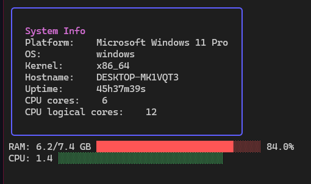

# Sauron 🧙‍♂️

<p align="center">
  
</p>

Small CLI utility to monitor resources, currently just CPU and RAM usage.

# Features ✨
- 🖥️ Real-time system monitoring

- 🎨 Beautiful Dracula-themed UI

- 📊 Visual resource usage bars

## Dependencies 📃

- Bubbletea
- Lipgloss
- Gopsutil

## Installation 🚀

Prerequisites
- Go 1.21 or later
- Git

From Source:
```sh
# Clone the repository
git clone https://github.com/Yoru-cyber/sauron.git
cd sauron

# Build and install
go install ./cmd/sauron/

# Run it
sauron
```

## License ⚖️

This project is under GPL-v3, see ``LICENSE`` for more info.